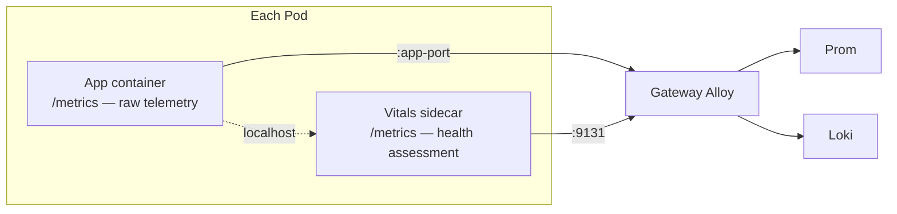
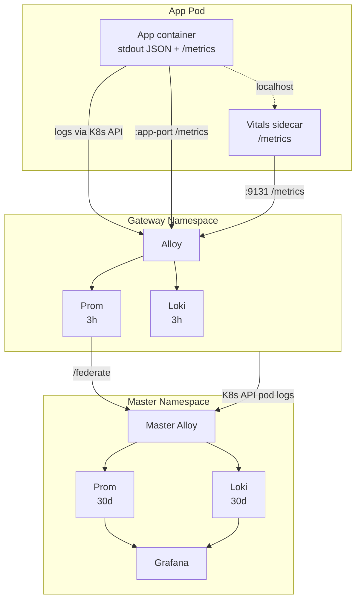

# Observability Contract

How apps expose telemetry to the platform. Three concerns — logs, metrics, health — with clear ownership boundaries.

## Overview



| Concern | Owner | Interface | Consumer |
|---------|-------|-----------|----------|
| **Logs** | app container | structured JSON → stdout | Gateway Alloy (tails via K8s API) |
| **Metrics** | app container | `/metrics` on app port | Gateway Alloy (scrapes) |
| **Health** | vitals sidecar | `/metrics` on `:9131` | Gateway Alloy (scrapes) |

## Logs

Apps write structured JSON to stdout. No special libraries required — any logger that outputs JSON works.

Gateway Alloy tails pod stdout via the K8s API and writes to Loki. Log delivery is **best-effort** — apps must not block on stdout. Kubernetes buffers stdout in container runtime log files, which rotate.

Required fields:

| Field | Purpose |
|-------|---------|
| `level` | Log level (info, warning, error) |
| `event` | What happened |

Additional fields are app-defined and become Loki labels automatically via the Alloy processing pipeline.

## Metrics

Apps expose `/metrics` in Prometheus format on their process port. Gateway Alloy discovers and scrapes via pod annotations.

Required pod annotations:

```yaml
annotations:
  prometheus.io/scrape: "true"
  prometheus.io/port: "<app-metrics-port>"
```

Gateway Alloy normalizes metrics — drops raw `kube_*`/`kafka_*` prefixes, keeps `pipeline_*` and app-specific metrics. Apps should use descriptive metric names with an app-specific prefix.

## Health (Vitals Sidecar)

Each pod includes a **vitals** sidecar container that evaluates the app container's health and produces standardized health gauges.

### How it works

1. Vitals reads the app container's `/metrics` via **localhost** (same pod, shared network namespace)
2. Evaluates thresholds and health logic (app-specific)
3. Exposes `vitals_*` gauges on `:9131/metrics`
4. Gateway Alloy scrapes the vitals port like any other metrics endpoint

### Metric convention

All gauges use **0 = FAIL, 1 = WARNING, 2 = OK**.

| Metric | What it answers |
|--------|----------------|
| `vitals_process{process}` | Is this process alive? |
| `vitals_<section>{check}` | Is this concern healthy? |
**Recommended sections** — use these when the concern fits, extend with app-specific sections as needed:

| Section | What it covers |
|---------|---------------|
| `vitals_deps` | External dependencies (databases, APIs, caches) |
| `vitals_ingestion` | Data intake pipelines (Kafka lag, consumption rates) |
| `vitals_storage` | Persistence layer (PVC usage, DB file sizes) |
| `vitals_serving` | Request handling, API readiness |
| `vitals_queue` | Message queue consumers/producers |

Check labels should be short, specific, snake_case: `vitals_deps{check="postgres_primary"}`, not `vitals_deps{check="pg"}`.

### Pod spec

Use **named ports** so Gateway Alloy can target both containers by port name:

```yaml
containers:
  - name: my-app
    ports:
      - containerPort: 9100
        name: metrics
  - name: vitals
    ports:
      - containerPort: 9131
        name: vitals
```

### Startup ordering

The vitals sidecar must handle the app container not being ready yet:

- Treat failed localhost scrape as FAIL (not crash)
- Retry with backoff until app is reachable
- Set a timeout (5s) on localhost scrape — treat timeout as a health signal

### Meta-alerting

The platform should detect silent sidecar failures:

```yaml
- alert: VitalsMissing
  expr: absent(vitals_process)
  for: 5m
  labels:
    severity: warning
```

## Data flow



## When to use

- Every app deployed to the cluster
- Any service that needs health visibility in Grafana
- Apps with multiple processes that need per-component health tracking

## When not to use

- Short-lived jobs or CronJobs — use exit codes and job status metrics instead
- Platform infrastructure (Alloy, Prom, Loki) — these have their own health mechanisms

## Related patterns

- [Sidecar](sidecar.md) — vitals is a canonical sidecar use case
- [Service Manager](service-manager.md) — managed processes should comply with this contract
