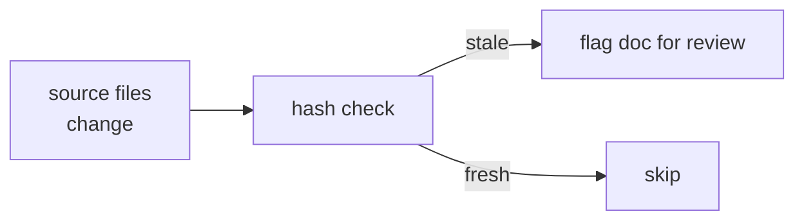

# Source Map

Maps documentation pages to their implementation sources. Used by `/scribe:audit-docs` to detect drift.

## How It Works

Each doc page lists the implementation files it describes. The audit skill hashes these source files and compares against stored hashes — if sources changed but the doc wasn't updated, it flags the doc as potentially stale.

The source map lives at `docs/.source-map.yaml`. Run `/scribe:audit-docs` to check for drift.

## Mapping

| Doc Page | Implementation Sources |
|----------|----------------------|
| **index.md** | `agents/IDENTITY.md`, `agents/shared/MEMORY.md`, `installer/link-claude.sh` |
| **infrastructure.md** | `bin/claude-session`, `deployer/memory/static/infra.md`, deployer manifests |
| **agents.md** | `agents/*/IDENTITY.md`, `agents/shared/MEMORY.md` |
| **hooks.md** | `hooks/*.sh`, `lib/cache.sh`, `settings.json` |
| **consultation.md** | `commands/consult.md`, `commands/invalidate.md`, `agents/*/instructions/consultation.md` |
| **memory.md** | `hooks/agent-memory.sh`, `agents/shared/MEMORY.md`, `lib/cache.sh` |
| **reference/link-mapping.md** | `installer/link-claude.sh` |
| **reference/patterns/\*.md** | `agents/designer/memory/static/patterns/*.md` |
| **reference/libraries/\*.md** | `agents/designer/memory/static/libraries/*.md` |

## Ownership

| Content | Owner | Human docs |
|---------|-------|-----------|
| Pattern definitions | designer agent (`memory/static/patterns/`) | `docs/reference/patterns/` |
| Library docs | designer agent (`memory/static/libraries/`) | `docs/reference/libraries/` |
| Infrastructure facts | deployer agent (`memory/static/infra.md`) | `docs/infrastructure.md` |
| Hook implementations | `hooks/*.sh` | `docs/hooks.md` |
| Consultation protocol | `commands/consult.md` | `docs/consultation.md` |

Agent source files are the authority for facts. Human docs interpret and present them — they don't need to mirror the agent file structure.
